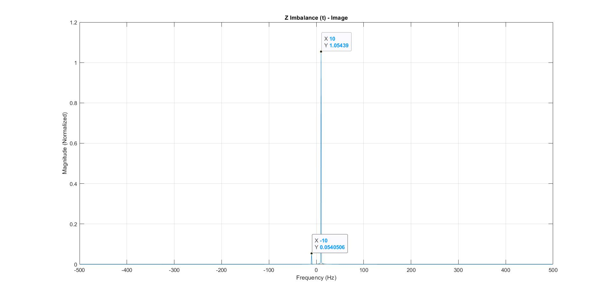

# IQ Imbalance 
IQ imbalance refers to imperfections in the In-phase (I) and Quadrature (Q) components of a signal in a communication system. In an ideal IQ modulator/demodulator, the I and Q signals are orthogonal (90 degrees apart), and they have the same amplitude. However, practical systems may have mismatches that result in amplitude and phase imbalance.

Causes of IQ Imbalance:
- **Amplitude imbalance:** The magnitudes of the I and Q signals are not equal.
- **Phase imbalance:** The phase difference between I and Q is not exactly 90 degrees.

---
## Image Signal

An **image signal** is an unwanted signal that appears at the mirror frequency of the desired signal in communication systems. It occurs due to imperfections in I/Q modulation, where the In-phase (I) and Quadrature (Q) components are not perfectly balanced. The image signal causes interference, reduces signal quality, and can lead to errors in demodulation.

---
## Desin And Simulation

The input to the transmitter is a single-tone signal, Z(t) = cos(2πfmt) + j sin(2πfmt). There is an imbalance between the transmitter and receiver, with the receiver's Q branch experiencing a gain imbalance and phase imbalance. The gain imbalance is estimated to be 0.9, while the phase imbalance is assumed to be 0.

  *Figure 1: Input Singal Tone*

After demodulation, the output signal differs from the input to the transmitter due to IQ imbalance.

  *Figure 2: Output Signal with Image*

The pilot signal was configured to estimate the imbalance parameters, including gain and phase, and use them to correct the output signal.

The transformation matrix, along with the estimated gain and phase parameters, was used to recover the original input signal without error.

  *Figure 3: Output Signal without Image - Estimated Parameters*

  *Figure 4: Output Signal without Image - Correct Parameters*

Figures 3 and 4 demonstrate the similarity in retrieving the input signal without the image, whether using the estimated gain and phase parameters or the exact ones, indicating accurate estimation and successful signal retrieval.

---

